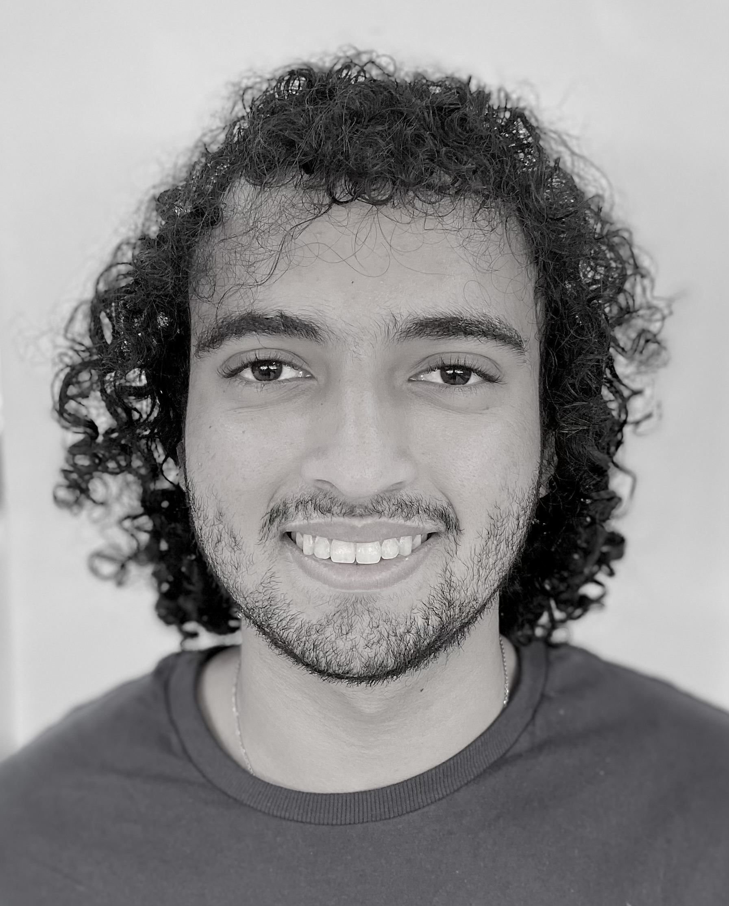

# Who is me?

## Tiago Barretto Sant'Anna
<html>
<head>

</head>
</html>

<body>

  

    
  

  

    <a>
        Engineering student, passionate about robotics and project development.

        Born in 2003 in the city of Salvador, Bahia, Brazil. In high school, he attended the Sesi Djalma Pessoa school where he participated in robotics championships. In the second half of 2020 he entered the mechatronics technical course and in 2021 he began his graduation and electrical engineering, both of which he is currently studying at the Senai CIMATEC institution.

        In addition, he currently works as a volunteer at the robotics and autonomous systems competence center and works as a member of ieee carrying out projects
    </a>
  

</body>

