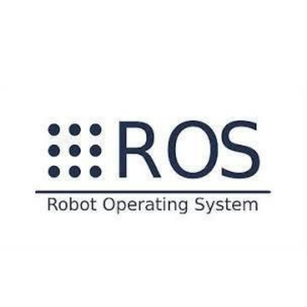
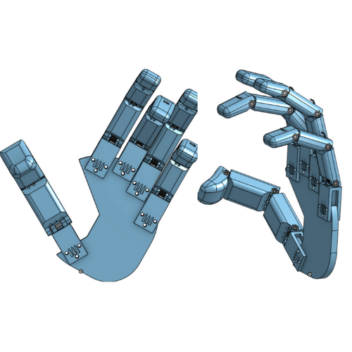

<html>
<head>

</head>
</html>

# Projects

This pages contains all the projects that I maked in the currently years

## Robotics & Autonomous Systems Competence Center

<body>

  

    
  

  

    
  

  

    
  

</body>

## IEEE

<body>

  

    
  

  

    

